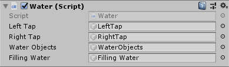
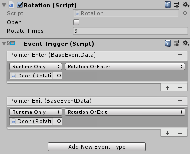
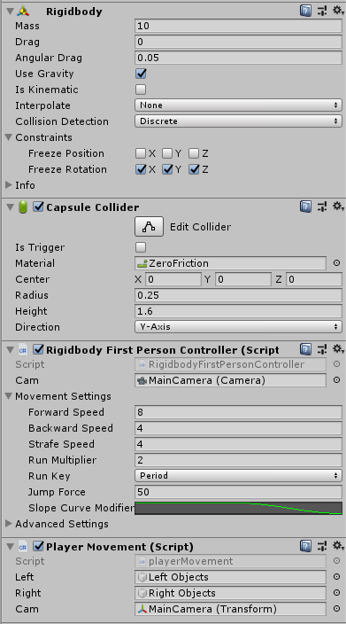
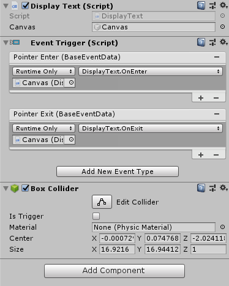
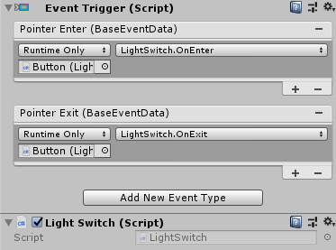
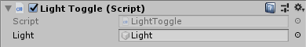

# BlindToilets

## Scripts
- Water:

The Water script is used to both make the water appear/disappear in sinks, and make the water rise/lower. It does this by, increasing the local size of the water in the sink (by the amount of SIZE), and then increasing the local height (by the amount of DISTANCE) of the game object. Then, when the user clicks on the tap a second time, the script does the inverse (decreasing the size by SIZE, and the height by DISTANCE).
  

Where the the left tap object is the tap on the left of the sink. The right tap object is the tap on the right of the sink. The water objects is the water flowing from the tap. And the filling water object is the flat circle which raises and lowers.

- Rotation:

The Rotation script is used to rotate the doors and taps in the model. It takes in a variable called RotateTimes, which is the number of times the object will rotate by 10 degrees around the Y-axis. Like the Lights script, it uses the GVR Controller, and a unity event trigger to run.

This script requires a unity prebuilt event trigger. After this has been applied, you add in a pointer enter and exit trigger, press the little plus at the base, drop your object into the gameobject space, and then find the script and method in the right hand drop down box. To use the rotation script, add in a empty game object where you want the rotation to occur, attach the script to the game object, and then make all objects you want to rotate children of that gameobject.

- PlayerMovement:

The Player Movement script is used to move the player around the scene, based on where they are looking, and where their finger moves on the touchpad. It does this by using the camera positions (ie where the user is looking). Then combining that with the relative distance between where the user started touching the touchpad, and then where they are now. The script also is used to deal with trigger management, between the user and triggers in the world. It does this by comparing what the user object is colliding with, to the tags on specific triggers. For example, in my project, I’ve used the triggers to load/unload the large objects in the model, which require a lot of polygons to create.

This script requires the prebuilt rigidbodycontroller prefab from the standard unity assest. I have gone through and remove the movement part of the controller, so that I could create my own using the GVRController. The gameobjects that the script contains are, the left and right objects, and the main camera. The left and right objects are used with the triggers on the model, to show/hide specific parts to reduce frame drops. In this case, it is the objects on the left side of the model, and the objects on the right. The main camera is used to modify where the user moves when they move their finger around on the touch pad.

- DisplayText:

The Display Text script is used to show visual text in 3D space. It modifies the canvas's alpha value (transparency) to make the text appear to fade in when hovered over, and fade out when not hovered over. It takes in a canvas that the text will appear on, however, the canvas requires a canvas group on it. This can be accessed under the "Text" prefab.

The canvas gameobject that is canvas object which holds the backing panel, and the text that appears beside the question mark. Like the rotation script, this script requires the prebuilt event trigger, and a box collider (just to generate trigger responses).

- LightSwitch:

The Light Switch script is an updated version of the Lights script. However, while it does all the same things as the Lights script, instead of handling turning the lights on and off, it calls the Light Toggle script's method Toggle.

The only thing this script requires is the prebuilt event trigger.

- LightToggle:

The Light Toggle script is used solely to activate/deactivate the point light above the player.
  

This script just requires a reference to the point light that is above the player.

- OpenDoor (deprecated):
The OpenDoor script was the original script to open and close doors. However, this just had them snapping back and forth between opened and closed. It was replaced by the Rotation script.
- Lights (deprecated):
The Lights script uses the GVR Controller, and a unity event trigger to activate/deactivate the Lights game object that is attached to the unity script. It also displays the “interactable” when the controller hovers over the button. This script could be used to turn game objects on and off, depending on when the user clicks on another game object in the application.

## Production
This project requires an up-to-date version of unity to edit. It along with an Android SDK and a Java JDK, are required to install the project onto a mobile device. These can both be installed when updating unity to the latest version.

## Issues
One of the main issues that I’ve encountered with this project, is performance. In using the large model, which I was given by the modelling people that I was working with, it meant that firstly, trying to import the model into unity was a pain and took ages. And secondly trying to run the model for the first time (before I removed some parts) meant that I was trying to run it on around 10 frames per second. This would never have worked on a phone at all since the specs of the phone are a lot worse than the PC (just based on that it’s a phone, not a computer). This meant that I had to go through the model removing parts that had massive amounts of single polygons so that I could improve performance. The second way I improved performance, was through the use of triggers. I’ve set the triggers up to remove bit parts of it when the player isn’t in that exact side of the model. This dramatically improved performance, to the point where I was able to run the program on the phone, while still being able to sustain ~30fps.

The other issue with importing the model into unity was that some parts of the model didn’t have completely drawn textures. For example, the toilets are missing a top side, so the user can look down through the bowl. Whereas if in unity, you look from the bottom of the object, it is still has a texture drawn on the bottom. This continues to be an issue for the project, as it is something I cannot fix myself.

## Usage
This program is designed to be run on a phone in a virtual reality environment, so it has to be run on a phone which supports Google daydream. This is because it uses a lot of the Google VR functionality, to provide an interactable environment. Once the program is launched on the phone, and the user puts on the daydream headset, they will be loaded into the program. The user can move around the model by moving their finger around on the touchpad on the daydream controller. This moves them relatively to where their finger was when they started moving, where it is now on the touchpad, and then where the user is looking. It is designed so that if the user moves their finger forward on the controller, it will move them forward in the direction that they are looking.
If the user wishes to interact with parts of the model, all they have to do is hover the controller pointer over something in the model, and it will display “interactable” over the controller. This means that the player can interact with this part of the model by using the button with a ridge on it.

## To Do
- More performance increases.
